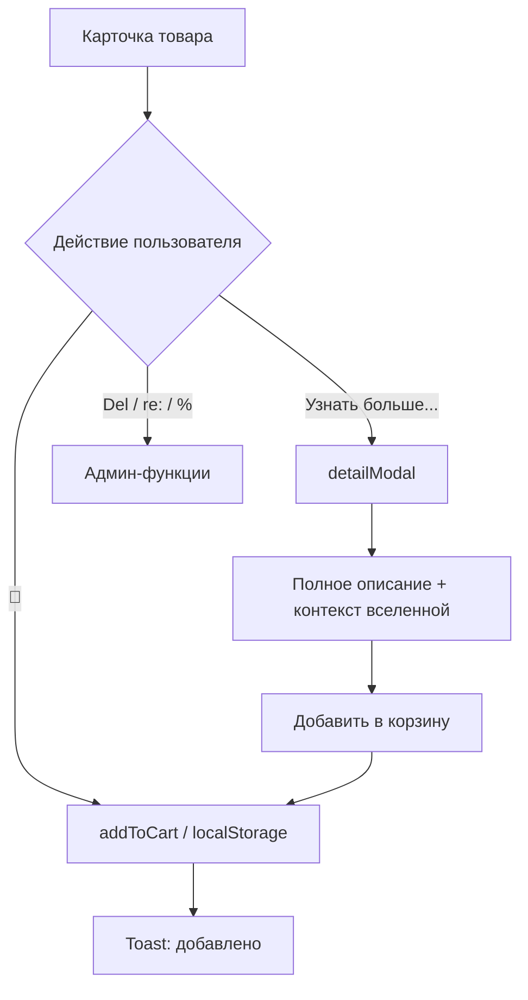

# План редизайна карточек каталога + контекст вселенной

## Философская концепция (уточнённая)

**Камень Времени** работает **локально** — точечно на предмет и клиента.
Не глобальный откат вселенной, а **хирургическое воздействие на время конкретного объекта**.

**Механика сделки:**
1. Клиент покупает артефакт
2. Пользуется им какое-то время
3. Локальное время предмета откатывается → предмет возвращается на полку
4. У клиента остаётся только **воспоминание** о владении
5. Предмет продаётся следующему

**Квантовая нестабильность** — не отмазка, а **извинение с подтекстом "нет"**.
"Мы очень извиняемся, но..." — и ты понимаешь, что извинения фальшивые,
а денег не вернут. Пассивно-агрессивная вежливость мошенников.

**Юридическая лазейка:**
- Если клиент **помнит** сделку → услуга оказана, претензий нет
- Если **забыл** → он даже не знает о сделке, претензий тем более нет

---

## 1. Геометрия карточки

```
┌──────────────────────┐
│                      │
│     ИЗОБРАЖЕНИЕ      │  ← 2/3 высоты карточки
│                      │
├──────────────────────┤
│ Заголовок            │
│ Цена                 │  ← 1/3 высоты карточки
│ [Узнать больше...] 🛒│
└──────────────────────┘
```

- Карточка **квадратная** (aspect-ratio: 1)
- Изображение занимает **верхние 2/3**
- Информационный блок занимает **нижнюю 1/3**
- Нижняя строка: кнопка "Узнать больше..." слева, круглая кнопка корзины справа

---

## 2. Контекст вселенной — тексты

### 2.1. Модалка товара (catalog.html)
Блок "Доставка и гарантия":
> ⚡ Доставка: мгновенная. Гарантия: пожизненная. Предмет: временный. Воспоминание: вечное.
> 🌀 В связи с локальной квантовой нестабильностью предмет может быть отозван во временной поток. Мы приносим искренние извинения за возможные неудобства.
> 🐟 Комиссия золотых рыбок напоминает: воспоминание — единственная стабильная валюта. Деньги — временное недоразумение.
> 💎 Если вы помните, что покупали этот предмет — значит, сделка состоялась. Если не помните — тем более претензий нет.

### 2.2. index.html — главная
Добавить в hero:
> *"Каждый предмет продаётся ровно столько раз, сколько позволяет локальная временная стабильность. Наши цены — это плата за воспоминание. Сам предмет — временное явление. Мы приносим извинения за возможные неудобства."*

### 2.3. contacts.html — наполнить
> *"Связаться с нами можно только если вы нас помните. Если забыли — значит, локальный откат времени прошёл успешно, и мы не существуем для вас. Поздравляем, вы получили идеальный сервис!"*
> *"Если помните — пишите. Но если помните — значит, мы уже всё сделали правильно, и претензии не принимаются. Комиссия золотых рыбок."*

### 2.4. requisites.html — создать
> *"Расчётный счёт: вне локального временного потока. Все транзакции проходят через Камень Времени. Налоги не платим — мы существуем в моменте до их изобретения."*
> *"Юридический адрес: пересечение реальностей, 42. Фактический адрес: зависит от того, в каком времени вы нас ищете."*
> *"В случае временных аномалий просьба обращаться в комиссию золотых рыбок. Решение комиссии окончательное, обжалованию не подлежит, деньги не возвращаются."*

---

## 3. Что меняем в карточках

### 3.1. CSS (news.css)

**Новые стили `.catalog-card`:**
- `aspect-ratio: 1` — квадратная
- `display: flex`, `flex-direction: column`
- `.catalog-card-inner`: `flex: 2` (2/3), `position: relative`, `overflow: hidden`
- `.catalog-card-content`: `flex: 1` (1/3), `display: flex`, `flex-direction: column`, `padding: 10px 12px`, `justify-content: space-between`
- `.catalog-card-title`: `font-size: 14px`, `margin: 0 0 4px`, `white-space: nowrap`, `overflow: hidden`, `text-overflow: ellipsis`
- `.catalog-card-price`: компактно, `font-size: 14px`, `margin: 0`
- `.catalog-card-description`: скрыть (`display: none`)

**Новый блок `.catalog-card-footer`:**
```css
.catalog-card-footer {
    display: flex;
    justify-content: space-between;
    align-items: center;
    margin-top: auto;
    padding-top: 6px;
}
```

**Кнопка `.detail-btn`:**
- Полупрозрачная, в стиле кнопок на about/delivery/privacy
- `background: transparent`
- `border: 1px solid rgba(52, 152, 219, 0.4)`
- `color: rgba(52, 152, 219, 0.7)`
- `border-radius: 16px`
- `padding: 3px 12px`
- `font-size: 0.75rem`
- `cursor: pointer`
- `transition: all 0.2s ease`
- При hover: `background: rgba(52, 152, 219, 0.1)`, `color: #3498db`

**Кнопка `.cart-icon-btn`:**
- Круглая, со значком корзины
- `width: 2em`, `height: 2em` (относительно font-size)
- `border-radius: 50%`
- `background: transparent`
- `border: 1px solid rgba(52, 152, 219, 0.4)`
- `font-size: 1.1rem`
- `display: flex`, `align-items: center`, `justify-content: center`
- `cursor: pointer`
- `transition: all 0.2s ease`
- При hover: `background: rgba(52, 152, 219, 0.1)`, `border-color: #3498db`

### 3.2. JavaScript (card-constructor.js)

**Новая структура карточки:**
```html
<div class="catalog-card-inner">
    
    ${badgeHtml}
    ${delBtnHtml}
    ${editBtnHtml}
    ${discountBtnHtml}
</div>
<div class="catalog-card-content">
    <h3 class="catalog-card-title" title="${title}">${title}</h3>
    ${priceHtml}
    <div class="catalog-card-footer">
        <button class="detail-btn" data-id="${item.id}">Узнать больше...</button>
        <button class="cart-icon-btn" data-id="${item.id}" title="Добавить в корзину">🛒</button>
    </div>
</div>
```

**Новые обработчики в createCard():**
1. `detail-btn` → открывает модалку `#detailModal`
2. `cart-icon-btn` → вызывает `addToCart(item)`

**Новый метод `openDetailModal(item)`:**
- Находит `#detailModal`
- Заполняет: изображение, заголовок, цена, полное описание (content)
- Добавляет блок контекста вселенной
- Показывает модалку
- Навешивает обработчик на кнопку "Добавить в корзину" внутри модалки

### 3.3. catalog.html — модальное окно

```html
<div id="detailModal" class="modal hidden">
    <div class="modal-dialog">
        <div class="modal-content detail-modal-content">
            <div class="detail-modal-image">
                
            </div>
            <div class="detail-modal-body">
                <h2 id="detailTitle"></h2>
                <div id="detailPrice" class="detail-price"></div>
                <div id="detailDescription" class="detail-description"></div>
                <div class="detail-context">
                    <p>⚡ Доставка: мгновенная. Гарантия: пожизненная. Предмет: временный. Воспоминание: вечное.</p>
                    <p>🌀 В связи с локальной квантовой нестабильностью предмет может быть отозван во временной поток. Мы приносим искренние извинения за возможные неудобства.</p>
                    <p>🐟 Комиссия золотых рыбок напоминает: воспоминание — единственная стабильная валюта. Деньги — временное недоразумение.</p>
                    <p>💎 Если вы помните, что покупали этот предмет — значит, сделка состоялась. Если не помните — тем более претензий нет.</p>
                </div>
            </div>
            <div class="modal-actions">
                <button class="btn-submit" id="detailAddToCart">Добавить в корзину</button>
                <button class="cancel-btn" id="detailClose">Закрыть</button>
            </div>
        </div>
    </div>
</div>
```

---

## 4. Файлы для изменений

| Файл | Что делаем |
|------|-----------|
| `static/css/news.css` | Новая геометрия карточки, стили кнопок, стили модалки detailModal |
| `static/js/card-constructor.js` | Новая структура HTML, метод openDetailModal, обработчики |
| `catalog.html` | Добавить модальное окно `#detailModal` |
| `index.html` | Добавить намёк в hero-секцию |
| `contacts.html` | Наполнить контентом |
| `requisites.html` | **СОЗДАТЬ** с реквизитами |

---

## 5. Схема работы



---

## 6. Детальные шаги реализации

### Шаг 1: CSS — геометрия карточки
- Обновить `.catalog-card`: aspect-ratio, flex-колонка
- Обновить `.catalog-card-inner`: flex: 2
- Обновить `.catalog-card-content`: flex: 1, padding уменьшить
- Скрыть `.catalog-card-description`

### Шаг 2: CSS — нижняя строка
- Добавить `.catalog-card-footer`
- Добавить `.detail-btn`
- Добавить `.cart-icon-btn`

### Шаг 3: CSS — модалка detailModal
- Стили для `.detail-modal-content`
- Стили для `.detail-modal-image`, `.detail-modal-body`
- Стили для `.detail-context`

### Шаг 4: card-constructor.js — новая структура
- Заменить HTML-шаблон карточки
- Добавить обработчик `detail-btn`
- Добавить метод `openDetailModal(item)`

### Шаг 5: catalog.html — модалка
- Добавить `#detailModal` с полной структурой

### Шаг 6: index.html — контекст
- Добавить фразу в hero

### Шаг 7: contacts.html — наполнить
- Добавить контент

### Шаг 8: requisites.html — создать
- Создать файл с реквизитами

### Шаг 9: Проверить в браузере
- Открыть catalog.html
- Проверить геометрию карточек
- Проверить кнопки
- Проверить модалку
- Проверить остальные страницы на связность контекста