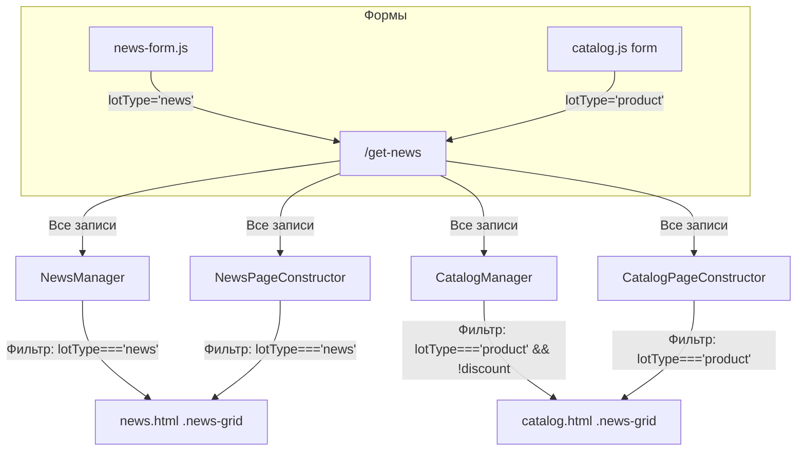

# План: Исправление логики конструкторов по lotType

## Проблема

Сейчас API `/get-news` отдаёт **все** записи из `data/news/` без фильтрации. Конструкторы на клиенте вынуждены фильтровать вручную, а `NewsManager` на `news.html` вообще не фильтрует — показывает товары вместо новостей.

## Архитектура

```
/get-news (сервер) → все JSON из data/news/
    │
    ├── news.html → NewsManager (main.js) → рендерит ВСЁ (нет фильтра) ❌
    │                NewsForm → отправляет lotType='news' ✅
    │
    ├── catalog.html → CatalogManager (catalog.js) → фильтр: lotType==='product' || price
    │                   CatalogPageConstructor → фильтр: lotType==='product' || price
    │                   CatalogForm → отправляет lotType='product' ✅
    │
    └── actions.html → ActionsPageConstructor → фильтр: discount > 0
```

## Текущее состояние полей lotType в data/news/

Все файлы имеют `"lotType": "product"` — это товары. Новостей с `lotType: "news"` нет.

## План изменений

### 1. NewsManager.renderNews() — фильтр по lotType === 'news'

**Файл:** `static/js/news-manager.js` (строка ~129-176)

Сейчас `renderNews()` рендерит **все** записи из `this.newsList`. Нужно добавить фильтр:

```js
const visibleNews = this.newsList.filter(item => item.lotType === 'news');
```

Это единственное изменение — никаких лишних проверок. Конструктор сам решает, что показывать.

### 2. CatalogManager.renderProducts() — фильтр остаётся, но уточнить

**Файл:** `static/js/catalog.js` (строка ~35-37)

Сейчас фильтр: `(item.lotType === 'product' || item.price) && !(item.discount && item.discount > 0)`

Вторая часть `&& !(item.discount...)` — это чтобы товары со скидкой уходили в Акции. Это логично. Оставляем как есть, но убираем `|| item.price` — если у товара нет `lotType === 'product'`, но есть цена — это всё равно не товар. Лишняя проверка.

Новый фильтр:
```js
if (item.lotType === 'product' && !(item.discount && item.discount > 0))
```

### 3. CatalogPageConstructor — синхронизировать фильтр

**Файл:** `static/js/catalog-page-constructor.js` (строка ~28)

Сейчас: `n => n.lotType === 'product' || n.price`

Изменить на:
```js
n => n.lotType === 'product'
```

### 4. NewsPageConstructor — добавить фильтр по lotType === 'news'

**Файл:** `static/js/news-page-constructor.js` (строка ~86-99)

Сейчас `loadNews()` загружает все новости без фильтра. Нужно добавить фильтр:

```js
const news = await response.json();
return (news.news || []).filter(n => n.lotType === 'news' || !n.lotType);
```

`|| !n.lotType` — для обратной совместимости со старыми записями без поля lotType.

### 5. Создать тестовую новость

Создать JSON-файл `data/news/test-news-001.json` с `lotType: "news"` для проверки.

## Что НЕ нужно менять

- **`lotType` → `cardType`** — переименование не требуется, это не влияет на скорость
- **Сервер `siss.py`** — `/get-news` и `/save-news` работают корректно
- **Формы** — `news-form.js` уже отправляет `lotType: 'news'`, `catalog.js` — `lotType: 'product'`
- **`ActionsPageConstructor`** — фильтр по `discount > 0` корректен
- **Шаблоны** — `card-template.html` и `news-card.html` не требуют изменений

## Схема взаимодействия после исправлений



## Порядок выполнения

1. Создать тестовую новость `test-news-001.json` с `lotType: 'news'`
2. Исправить `NewsManager.renderNews()` — добавить фильтр `lotType === 'news'`
3. Исправить `CatalogManager.renderProducts()` — убрать `|| item.price`
4. Исправить `CatalogPageConstructor.loadNews()` — убрать `|| n.price`
5. Исправить `NewsPageConstructor.loadNews()` — добавить фильтр `lotType === 'news'`
6. Проверить: `news.html` показывает только новости, `catalog.html` — только товары