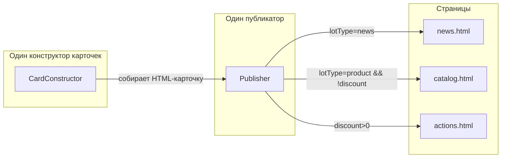

# План: Один конструктор, один публикатор

## Ключевая идея

> Поставил скидку через `%` → лот сам улетает на страницу акций.
> Никаких лишних действий, никаких рассчётов. Просто фильтр `discount > 0`.

## Суть

Всё — **один лот**. У лота есть поля: title, preview, content, image, price, discount, lotType.

- `lotType === 'news'` → новость
- `lotType === 'product'` → товар

## Архитектура (простая)



## Правила публикации

| Если | То на страницу |
|------|---------------|
| `lotType === 'news'` | `news.html` |
| `lotType === 'product'` и `discount` нет или 0 | `catalog.html` |
| `discount > 0` (любой lotType) | `actions.html` |

Один лот может попасть на две страницы: например, товар со скидкой — и в каталог, и в акции.

## Кнопки на карточке (только для админа, уровень >= 3)

```
┌─────────────────────┐
│ [Del]    Заголовок  │
│          Цена       │
│          Описание   │
│                [%]  │
└─────────────────────┘
```

- **`Del`** — слева сверху, полупрозрачная, удаляет лот
- **`%`** — справа сверху, полупрозрачная, открывает панель скидки (только для товаров)

Обе кнопки одинакового стиля: круглая, 32px, фон rgba(0,0,0,0.5), opacity 0.6, при наведении opacity 1.

## Что делаем

### 1. Создаём `static/js/card-constructor.js` — ЕДИНСТВЕННЫЙ конструктор

```js
class CardConstructor {
    // Собирает HTML-карточку из данных лота
    // Принимает: { id, title, preview, content, image, price, discount, lotType }
    // Возвращает: HTMLElement .catalog-card
    
    createCard(item) { ... }
    
    // Внутри:
    // - изображение (или заглушка)
    // - заголовок
    // - цена (если есть)
    // - описание (preview)
    // - бейдж скидки (если discount > 0)
    // - кнопка Del (если админ)
    // - кнопка % (если админ и lotType === 'product')
}
```

### 2. Создаём `static/js/publisher.js` — ЕДИНСТВЕННЫЙ публикатор

```js
class Publisher {
    // Загружает все лоты с /get-news
    // Раскладывает по страницам через data-атрибуты
    
    async publish() {
        const data = await fetch('/get-news');
        // Для каждой страницы:
        //   фильтрует лоты по правилам
        //   создаёт карточки через CardConstructor
        //   вставляет в контейнер
    }
}
```

Каждая страница вызывает `Publisher` и говорит, какой контейнер заполнять.

### 3. Удаляем мусор

Удалить файлы (они больше не нужны):
- `static/js/news-manager.js`
- `static/js/news-form.js`
- `static/js/news-page-constructor.js`
- `static/js/news-card-constructor.js`
- `static/js/news-template-engine.js`
- `static/js/catalog.js`
- `static/js/catalog-page-constructor.js`
- `static/js/actions-page-constructor.js`

### 4. Упрощаем `main.js`

`main.js` больше не импортирует кучу классов. Просто:
- Ждёт доступ
- Вызывает `Publisher.publish()` для текущей страницы

### 5. Одна форма

Форма одна (`#newsForm`), поля:
- Заголовок (обязательно)
- Дата
- Краткое описание
- Полный текст
- Цена (только для товаров)
- Изображение
- Тип лота (определяется по странице: news.html → news, catalog.html → product)

### 6. CSS

Стили для `.delete-btn` — такие же, как `.discount-btn`, только слева и с красным при наведении.

## Файлы для изменений

| Файл | Действие |
|------|----------|
| `static/js/card-constructor.js` | ✨ Создать |
| `static/js/publisher.js` | ✨ Создать |
| `static/js/news-manager.js` | 🗑️ Удалить |
| `static/js/news-form.js` | 🗑️ Удалить |
| `static/js/news-page-constructor.js` | 🗑️ Удалить |
| `static/js/news-card-constructor.js` | 🗑️ Удалить |
| `static/js/news-template-engine.js` | 🗑️ Удалить |
| `static/js/catalog.js` | 🗑️ Удалить |
| `static/js/catalog-page-constructor.js` | 🗑️ Удалить |
| `static/js/actions-page-constructor.js` | 🗑️ Удалить |
| `static/js/main.js` | ✏️ Упростить |
| `static/css/news.css` | ✏️ Добавить .delete-btn |
| `news.html` | ✏️ Убрать мёртвые скрипты |
| `catalog.html` | ✏️ Убрать мёртвые скрипты |
| `actions.html` | ✏️ Убрать мёртвые скрипты |

## Порядок выполнения

1. Создать `card-constructor.js`
2. Создать `publisher.js`
3. Упростить `main.js`
4. Обновить CSS (стили .delete-btn)
5. Обновить HTML-страницы (подключить новые скрипты, убрать старые)
6. Удалить мёртвые файлы
7. Проверить все три страницы