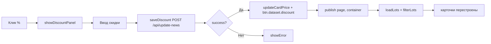

# План: три бага

## 1. % не отдаёт товар в акции

### Проблема
После установки скидки через кнопку `%` на карточке товара, `saveDiscount()` сохраняет скидку в JSON на сервере, обновляет цену на карточке (`updateCardPrice`), но **не перепубликовывает страницу**. Из-за этого:
- На `catalog.html` — товар со скидкой остаётся (он и должен), но бейдж/цена обновляются только через `updateCardPrice`
- На `actions.html` — товар со скидкой **не появляется**, пока не сделать F5

### Решение
В `saveDiscount()` после `btn.dataset.discount = discount` добавить вызов `this.publish(page, container)`.

`publish()` заново загрузит все лоты с сервера (`loadLots()`), пройдёт `filterLots(page)` и разложит лоты по страницам согласно правилам:
- `lotType === 'product' && discount > 0` → `actions.html`
- `lotType === 'product'` → `catalog.html`

**Файл**: [`static/js/publisher.js:247`](static/js/publisher.js:247)
**Что добавить** (после строки `btn.dataset.discount = discount;`):
```js
// Перепубликуем текущую страницу, чтобы акции обновились
await this.publish(page, container);
```

### Визуально


---

## 2. Заголовок улетает наверх

### Проблема
`.catalog-card-inner` имеет `height: 200px` (строка 74). Если изображение не загружается (битая ссылка, 500, нет файла), `img` не занимает места, блок схлопывается. Кнопки (Del, re:, %) остаются на месте (они `position: absolute`), но `.catalog-card-content` с заголовком прижимается к верху карточки.

### Решение
Заменить `height: 200px` на `min-height: 200px`.

**Файл**: [`static/css/news.css:74`](static/css/news.css:74)
**Что менять**:
```
-    height: 200px;
+    min-height: 200px;
```

---

## 3. Заглушка потерялась

### Проблема
`PathsHelper.get_fallback_path()` возвращает `images/img_n/400.png`, но файл не существует. Сервер в `serve_images()` доходит до строки 681, пытается открыть несуществующий файл → `FileNotFoundError` → HTTP 500.

**Подтверждено**: в `images/img_n/` нет `400.png`.

### Решение — создать файл-заглушку
Создать `images/img_n/400.png` — PNG 400×300, серый фон.

**Файл**: `images/img_n/400.png` (новый)

**Вариант B (запасной)**: если создание PNG почему-то не сработает, в `serve_images()` добавить проверку существования fallback'а и отдавать пустой SVG 1×1 как ultima ratio.

---

## Файлы для изменений

| Файл | Что меняем | Тип |
|------|-----------|-----|
| `static/js/publisher.js` | `saveDiscount()` — добавить `await this.publish(page, container)` | Изменение |
| `static/css/news.css` | `.catalog-card-inner` — `height` → `min-height` | Изменение |
| `images/img_n/400.png` | Создать PNG-заглушку 400×300 | Новый файл |

## Порядок выполнения

1. **publisher.js** — добавить перепубликацию после сохранения скидки
2. **news.css** — `height` → `min-height` для `.catalog-card-inner`
3. **Создать `400.png`** — заглушка для карточек без изображения
4. Перезапустить сервер
5. Проверить все три страницы