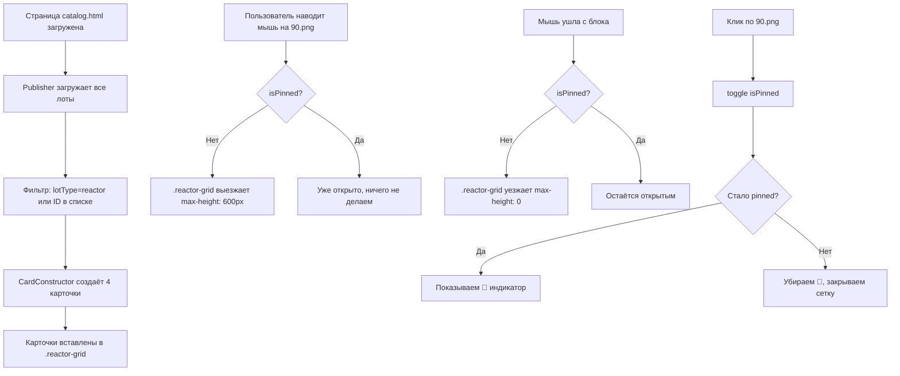

# План: Цена вправо + Подкаталог "Реакторы Тони Старка"

## ID лотов реакторов (уже созданы в data/)

| ID | Название | Цена | Изображение |
|----|----------|------|-------------|
| `1781620659290` | Дуговой реактор с палладием Марки I | 130 000 000 | `1781620659290.jpg` |
| `1781689109033` | Дуговой палладиевый реактор Mark II | 210 000 000 | `1781689109033.jpg` |
| `1781688836320` | Дуговой палладиевый реактор Mark III | 550 000 000 | `1781688836320.jpg` |
| `1781688934051` | Промышленный дуговой реактор | 340 000 000 | `1781688934051.jpg` |

Все имеют `lotType: "product"`. Фильтрация — по массиву ID.

## 1. Цена всегда прижата к правому краю

### Проблема
Сейчас `.catalog-card-price` использует `justify-content: space-between`. Это работает только когда есть два элемента (`.old-price` + `.new-price`). Когда скидки нет — цена одна и прижимается к левому краю.

### Решение (CSS + JS)

**CSS** ([`static/css/news.css`](static/css/news.css:125)):
- Изменить `.catalog-card-price` с `justify-content: space-between` на `justify-content: flex-end`
- `.new-price` больше не нужен `margin-left: auto` — убрать

```css
.catalog-card-price {
    display: flex;
    justify-content: flex-end;  /* было space-between */
    align-items: center;
    font-size: 14px;
    font-weight: bold;
    color: #e74c3c;
    margin-bottom: 4px;
    gap: 6px;
}
```

**JS** ([`static/js/card-constructor.js`](static/js/card-constructor.js:48)):
- В блоке `else` (без скидки) — обернуть цену в `<span>` с классом, чтобы flex-контейнер работал:

```javascript
// Было:
priceHtml = `<div class="catalog-card-price">${this.escapeHtml(item.price)} ₽</div>`;

// Стало:
priceHtml = `<div class="catalog-card-price"><span>${this.escapeHtml(item.price)} ₽</span></div>`;
```

**Результат:** цена всегда справа, независимо от наличия скидки.

---

## 2. Подкаталог "Реакторы Тони Старка"

### Концепция
Статический HTML-блок на [`catalog.html`](catalog.html), размещённый **под** `.products-grid`. Блок раздвигает контент вниз при активации.

### Структура блока

```
.reactor-subcatalog (весь блок)
├── .reactor-trigger (кликабельная область с 90.png)
│   ├── img[src="images/90.png"] (фоновая картинка-заглушка)
│   └── .reactor-caption (подпись "Реакторы Тони Старка в ассортименте")
└── .reactor-grid (выезжающая сетка 4 карточек)
    ├── .catalog-card (Mark I)
    ├── .catalog-card (Mark II)
    ├── .catalog-card (Mark III)
    └── .catalog-card (Mark IV)
```

### Поведение

| Событие | Действие |
|---------|----------|
| `mouseenter` на `.reactor-trigger` | `.reactor-grid` плавно выезжает (max-height от 0 до нужной высоты, opacity 0→1) |
| `mouseleave` с `.reactor-subcatalog` | `.reactor-grid` уезжает обратно (если не зафиксирован) |
| `click` на `.reactor-trigger` | Переключение режима **pin** (фиксация). Если был unpinned — фиксируем, если pinned — открепляем |
| Когда pinned | Карточки остаются видимыми даже при mouseleave |
| Повторный click | Снимает pin, карточки уезжают |

### Визуальный эффект выезда
- CSS transition: `max-height` + `opacity`
- Изначально `.reactor-grid` имеет `max-height: 0; opacity: 0; overflow: hidden`
- При hover/pin: `max-height: 500px` (достаточно для 2 рядов); `opacity: 1`

### Карточки реакторов
4 статические карточки в стиле `.catalog-card` (та же геометрия: `aspect-ratio: 1`, flex 2/1, кнопки detail + cart). Используют изображения `images/91.png`–`images/94.png`.

**Вариант A (простой):** HTML-карточки вёрстаются вручную в `catalog.html` в том же HTML-стиле, что генерирует CardConstructor.

**Вариант B (через CardConstructor):** В `catalog.html` добавляется `<div class="reactor-grid" data-reactor-ids="...">`, а в JS-скрипте на странице после загрузки Publisher создаются карточки через `CardConstructor.createCard()` для каждого из 4 лотов-реакторов.

**Рекомендуется Вариант B** — единообразие карточек, переиспользование кода.

### Данные реакторов (уже созданы пользователем)
4 лота с `lotType: product` (или `reactor`), изображения `91.png`–`94.png`. ID лотов нужно будет указать в скрипте.

---

## 3. Файлы для изменений

| Файл | Что меняем |
|------|-----------|
| [`static/css/news.css`](static/css/news.css) | Пункт 1: `.catalog-card-price` → `flex-end`. Пункт 2: стили `.reactor-subcatalog`, `.reactor-trigger`, `.reactor-grid`, анимация выезда |
| [`static/js/card-constructor.js`](static/js/card-constructor.js) | Пункт 1: обернуть цену без скидки в `<span>` |
| [`catalog.html`](catalog.html) | Пункт 2: добавить HTML `.reactor-subcatalog` под `.products-grid` + скрипт инициализации |

---

## 4. Пошаговый план выполнения

### Шаг 1: Цена вправо
1. В [`static/css/news.css:125-134`](static/css/news.css:125) — изменить `justify-content: space-between` на `flex-end`
2. В [`static/css/news.css:145-150`](static/css/news.css:145) — убрать `margin-left: auto` у `.new-price`
3. В [`static/js/card-constructor.js:59-61`](static/js/card-constructor.js:59) — обернуть цену без скидки в `<span>`

### Шаг 2: CSS подкаталога реакторов
Добавить в [`static/css/news.css`](static/css/news.css) в конец файла:

```css
/* ============================================================
   ПОДКАТАЛОГ "РЕАКТОРЫ ТОНИ СТАРКА"
   ============================================================ */
.reactor-subcatalog {
    margin-top: 30px;
    border-radius: 12px;
    overflow: hidden;
    background: rgba(255, 255, 255, 0.96);
    box-shadow: 0 2px 10px rgba(0,0,0,0.1);
}

.reactor-trigger {
    position: relative;
    cursor: pointer;
    overflow: hidden;
    border-radius: 12px;
}

.reactor-trigger img {
    width: 100%;
    height: 200px;
    object-fit: cover;
    display: block;
    transition: transform 0.3s ease;
}

.reactor-trigger:hover img {
    transform: scale(1.02);
}

.reactor-caption {
    position: absolute;
    bottom: 0;
    left: 0;
    right: 0;
    padding: 12px 20px;
    background: linear-gradient(transparent, rgba(0,0,0,0.7));
    color: #fff;
    font-size: 16px;
    font-weight: 600;
    text-align: center;
    pointer-events: none;
}

/* Выезжающая сетка */
.reactor-grid {
    display: grid;
    grid-template-columns: repeat(auto-fit, minmax(180px, 1fr));
    gap: 16px;
    padding: 0 16px;
    max-height: 0;
    opacity: 0;
    overflow: hidden;
    transition: max-height 0.4s ease, opacity 0.3s ease, padding 0.3s ease;
}

.reactor-subcatalog.is-open .reactor-grid,
.reactor-subcatalog.is-pinned .reactor-grid {
    max-height: 600px;
    opacity: 1;
    padding: 16px;
}

/* Индикатор pin */
.reactor-trigger .pin-indicator {
    position: absolute;
    top: 12px;
    right: 12px;
    width: 32px;
    height: 32px;
    border-radius: 50%;
    background: rgba(0,0,0,0.5);
    color: #fff;
    display: flex;
    align-items: center;
    justify-content: center;
    font-size: 14px;
    opacity: 0;
    transition: opacity 0.2s ease;
    pointer-events: none;
}

.reactor-subcatalog.is-pinned .pin-indicator {
    opacity: 1;
    background: rgba(52, 152, 219, 0.8);
}
```

### Шаг 3: HTML подкаталога
Добавить в [`catalog.html`](catalog.html) после закрывающего `</section>` (после `.catalog`):

```html
<!-- Подкаталог реакторов Тони Старка -->
<section class="reactor-subcatalog" id="reactorSubcatalog">
    <div class="reactor-trigger" id="reactorTrigger">
        
        <div class="reactor-caption">⚡ Реакторы Тони Старка в ассортименте</div>
        <div class="pin-indicator">📌</div>
    </div>
    <div class="reactor-grid" id="reactorGrid">
        <!-- Карточки будут созданы через CardConstructor -->
    </div>
</section>
```

### Шаг 4: JS-логика подкаталога
Добавить в [`catalog.html`](catalog.html) в существующий `<script>` блок (или отдельный скрипт после main.js):

```javascript
// Инициализация подкаталога реакторов
document.addEventListener('DOMContentLoaded', async () => {
    const subcatalog = document.getElementById('reactorSubcatalog');
    const trigger = document.getElementById('reactorTrigger');
    const grid = document.getElementById('reactorGrid');
    
    if (!subcatalog || !trigger || !grid) return;
    
    let isPinned = false;
    
    // Hover — открыть
    trigger.addEventListener('mouseenter', () => {
        if (!isPinned) subcatalog.classList.add('is-open');
    });
    
    // Убрали мышь — закрыть (если не pinned)
    subcatalog.addEventListener('mouseleave', () => {
        if (!isPinned) subcatalog.classList.remove('is-open');
    });
    
    // Клик — toggle pin
    trigger.addEventListener('click', () => {
        isPinned = !isPinned;
        subcatalog.classList.toggle('is-pinned', isPinned);
        if (isPinned) {
            subcatalog.classList.add('is-open');
        } else {
            subcatalog.classList.remove('is-open');
        }
    });
    
    // ID лотов реакторов (уже созданы в data/)
    const reactorIds = [
        '1781620659290', // Mark I
        '1781689109033', // Mark II
        '1781688836320', // Mark III
        '1781688934051'  // Промышленный
    ];
    
    try {
        const { Publisher } = await import('./static/js/publisher.js');
        const { CardConstructor } = await import('./static/js/card-constructor.js');
        
        const publisher = new Publisher();
        const constructor = new CardConstructor();
        
        // Загружаем все лоты
        const allItems = await publisher.loadAll();
        
        // Фильтруем по ID или по lotType
        const reactors = allItems.filter(item => 
            reactorIds.includes(item.id) || item.lotType === 'reactor'
        );
        
        reactors.forEach(item => {
            const card = constructor.createCard(item, { accessLevel: 0 });
            grid.appendChild(card);
        });
    } catch (err) {
        console.warn('[ReactorSubcatalog] Не удалось загрузить реакторы:', err);
        // Fallback: показать заглушку
        grid.innerHTML = '<p style="color:#999;text-align:center;padding:20px;">Реакторы временно недоступны</p>';
    }
});
```

**Важно:** ID лотов реакторов нужно будет узнать — посмотреть в `data/` файлы или спросить пользователя.

---

## 5. Схема работы подкаталога



---

## 6. Проверка в браузере

1. Открыть `catalog.html` — проверить что цена у товаров **без скидки** прижата к правому краю
2. Проверить что цена **со скидкой** тоже прижата к правому краю (старая слева, новая справа)
3. Навести мышь на блок реакторов — карточки должны плавно выехать
4. Убрать мышь — карточки должны уехать
5. Кликнуть по блоку — карточки зафиксируются (появится 📌)
6. Убрать мышь — карточки остаются
7. Кликнуть ещё раз — фиксация снимается, карточки уезжают
8. Проверить на мобильном разрешении — всё масштабируется